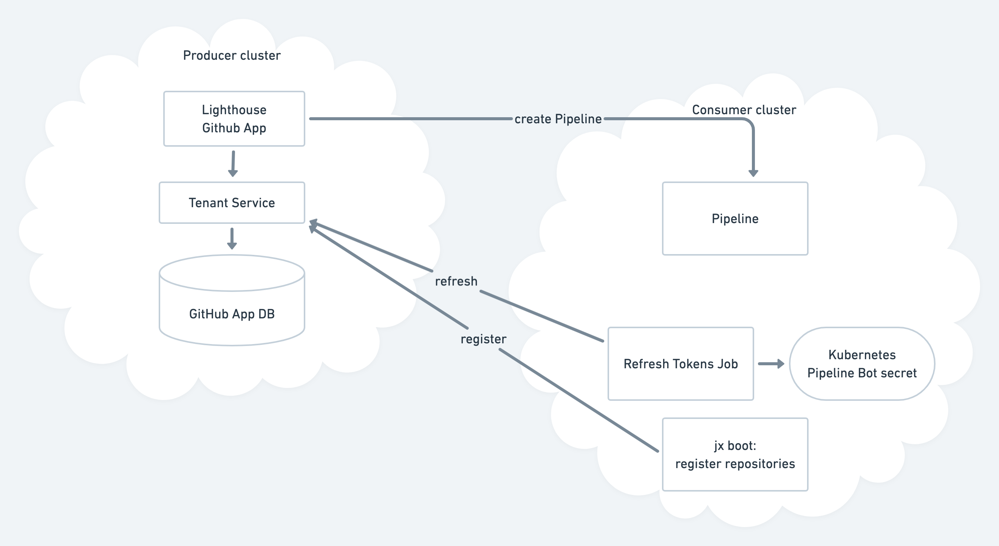

## Lighthouse GitHub App

This is a multi-tenant version of [Lighthouse](https://github.com/jenkins-x/lighthouse) for use in the SaaS which implements a GitHub App.

### How it works

Here is a [diagram](https://whimsical.com/48NiENaA7vYCu8bUtgUfh8) of how it works:

You can think of the Lighthouse GitHub App as like the regular Lighthouse - it handles webhooks from github, labels/comments on PRs and triggers pipelines - only it runs in a shared tenant rather than in each consumers cluster.

When the github app is installed to a github user/organisation all github webhooks for all repositories are sent to this HTTP endpoint.

Internally this service then queries the [jx-tenant-service](https://github.com/cloudbees/jx-tenant-service)'s REST API to query the workspaces and Scheduler JSON for the webhooks git URL.

Then for each webhook we:

* query the Workspace + Scheduler rows for the git URL
* for each Workspace + Scheduler:
  * connect to the remote Workspace project (for `KubeClient` / `JXClient` / `TektonClient` etc)
  * turn the `Scheduler` JSON into a lighthouse Prow `configs` and `plugins` configuration object
  * invoke the lighthouse webhook function [ProcessWebhook()](https://github.com/jenkins-x/lighthouse/blob/master/pkg/webhook/webhook.go#L233) to either comment on the PR or create a new pipeline in the tenant cluster via the metapipeline client.

### Environment variables

The following environment variables are required if you want to run this app locally:

| Name  |  Description |
| ------------- | ------------- |
| `LHA_APP_ID` | The GitHub App ID (shown on the Apps page) |
| `LHA_HMAC_TOKEN` | The HMAC token to verify webhooks |
| `LHA_PRIVATE_KEY_FILE` | The location of the private key file from the GitHub App |
| `BOT_NAME` | optional name of the current bot. e.g. `myapp[bot]` |

### Building

Run

    go build && ./lighthouse-githubapp
    
    
